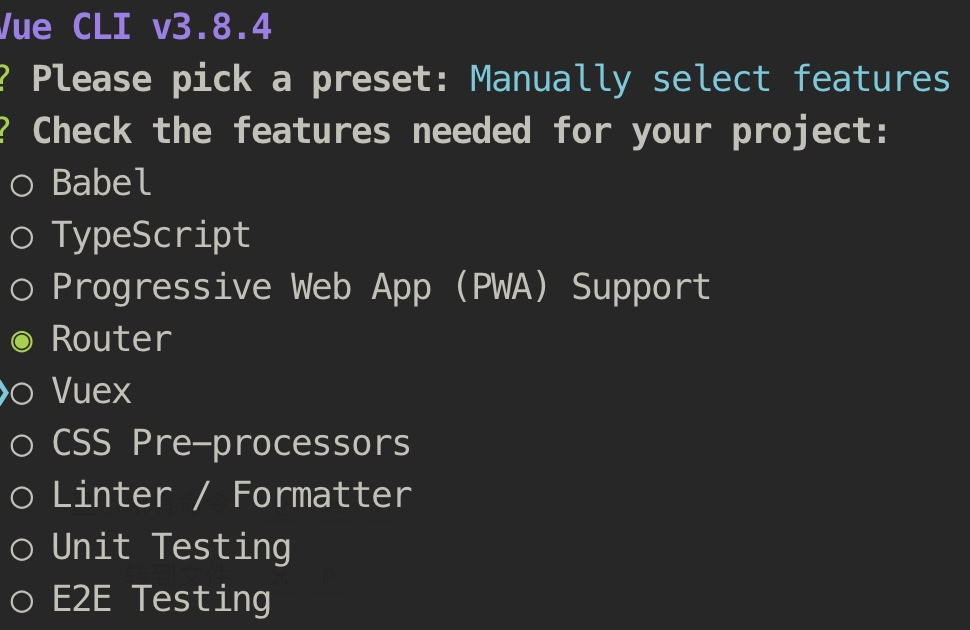
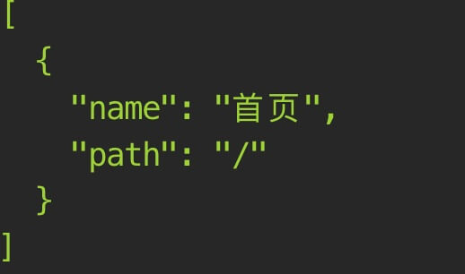
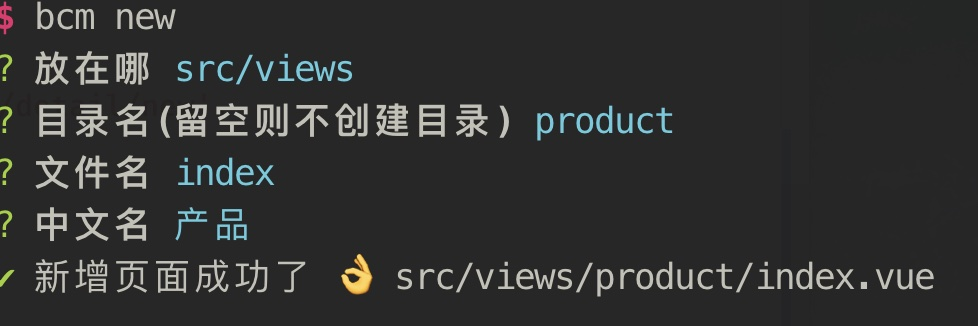
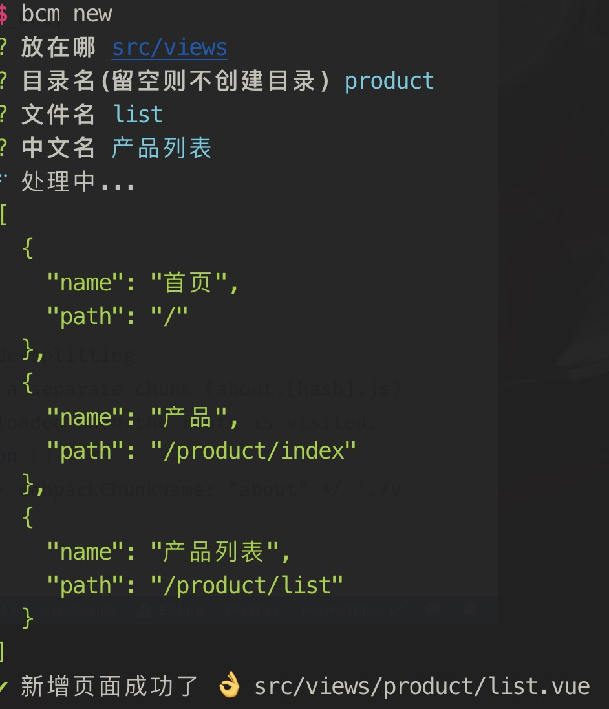
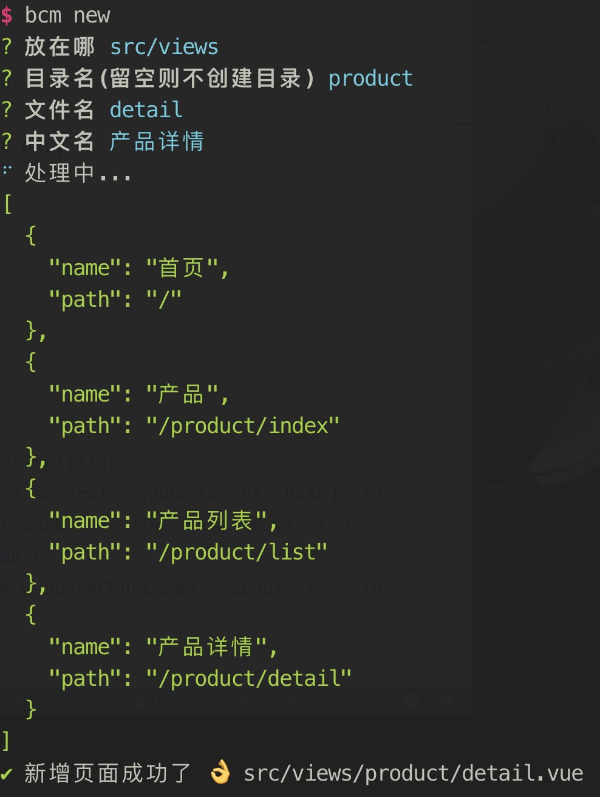

# Bread Crumb Menu 👋


## 安装

```bash
npm install bcm -g
// OR
yarn global add bcm
```

## 使用

```bash
bcm init // 初始化面包屑组件
bcm new  // 新增页面文件
bcm show // 显示面包屑的配置
```

在需要渲染面包屑的地方引入组件

```html
<template>
  <dp-bread-crumb />
</template>

<script>
  import DpBreadCrumb from './components/breadcrumb/dp-bread-crumb.vue'

  export default {
    components: {
      DpBreadCrumb
    }
  }
</script>
```

### init 命令使用说明

执行 init 命令会将组件文件以及 json 文件复制到 `src/components/breadcrumb` 目录，此时的 json 文件内容为

```json
[
  {
    "name": "首页",
    "path": "/"
  }
]
```

### new 命令使用说明

在使用 new 命令时，会问 4 个问题

1. 存放目录，即为新建的目录或页面的存放位置
2. 目录名，即为新增页面所在的目录，不填则直接在存放目录里，也可以输入多级目录，如 `aaa/bbb`
3. 文件名， 即为页面的文件名称
4. 中文名，为面包屑上显示的中文文字

## 例子

安装 `bcm`

```bash
yarn global add bcm
```

使用 `@vue/cli` 创建一个新的 `Vue` 项目

```bash
vue create my-vue-project
```

选择 `vue-router`



运行初始化命令

```bash
bcm init
```



在 `App.vue` 中引入组件

运行项目，此时页面上的面包屑渲染为


新增一个带子路由的页面





此时 `dp-bread-crumb.json` 为

```json
[
  {
    "name": "首页",
    "path": "/"
  },
  {
    "name": "产品",
    "path": "/product/index"
  },
  {
    "name": "产品列表",
    "path": "/product/list"
  },
  {
    "name": "产品详情",
    "path": "/product/detail"
  }
]
```

在 `router.js` 新增一项路由配置

```js
{
  path: '/product',
  name: 'product',
  component: Product,
  children: [
    {
      path: 'list',
      component: List
    },
    {
      path: 'detail',
      component: Detail
    }
  ]
}
```

访问新增的路由页面，面包屑渲染为

## Contributing

1. Fork it (<https://github.com/xrr2016/bread-crumb-menu.git>)
2. Create your feature branch (`git checkout -b feat/fooBar`)
3. Commit your changes (`git commit -am 'Add some fooBar'`)
4. Push to the branch (`git push origin feature/fooBar`)
5. Create a new Pull Request

## License

[MIT](LICENSE)

## Show your support

Give a ⭐️ if this project helped you!

---

_This README was generated with ❤️ by [readme-md-generator](https://github.com/kefranabg/readme-md-generator)_
